# LAB02 – Thiết lập Backend với NodeJS và ExpressJS

---

## Thông tin sinh viên

- Họ tên: Đinh Nguyễn Đức Tâm
- MSSV: 23521384
- Môn học: IE213.Q21 – Kỹ thuật phát triển hệ thống Web
- Lớp: IE213.Q21.1

---

## Mục tiêu

- Thiết lập môi trường NodeJS để phát triển backend
- Xây dựng server với ExpressJS
- Kết nối MongoDB Atlas
- Tổ chức project theo mô hình DAO – Controller – Route
- Xây dựng API /api/v1/movies để truy xuất dữ liệu movies

---

## Công cụ sử dụng

- NodeJS
- ExpressJS
- MongoDB Atlas
- MongoDB Compass
- VS Code

---

## Cấu trúc thư mục bài thực hành 2

```text
LAB02
├── movie-reviews/
│   └── backend/
│       ├── API/
│       │   ├── movies.controller.js
│       │   └── movies.route.js
│       ├── DAO/
│       │   └── moviesDAO.js
│       ├── node_modules/
│       ├── .env
│       ├── index.js
│       ├── package.json
│       ├── package-lock.json
│       └── server.js
├── Results/
└── Lab02.md
```

---

## Thực hiện

### Bài 1: Thiết lập môi trường

#### 1.1 Tải và cài đặt nodejs

**Kết quả**

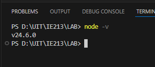

#### 1.2 Tải và cài đặt một trong các công cụ soạn thảo và quản lý mã nguồn như: Visual Studio Code, Sublime Text, Notepad++,...

**Kết quả**

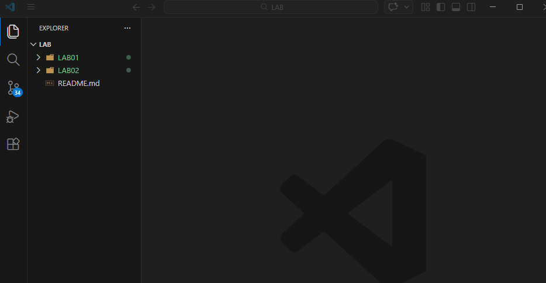

#### 1.3 Khởi tạo cây thư mục chứa mã nguồn của dự án: movie-reviews/backend

**Kết quả**

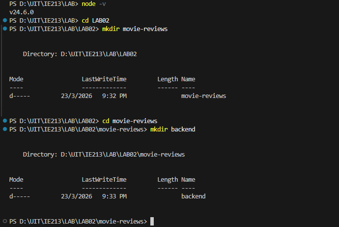

#### 1.4 Khởi tạo dự án với câu lệnh npm init

**Kết quả**

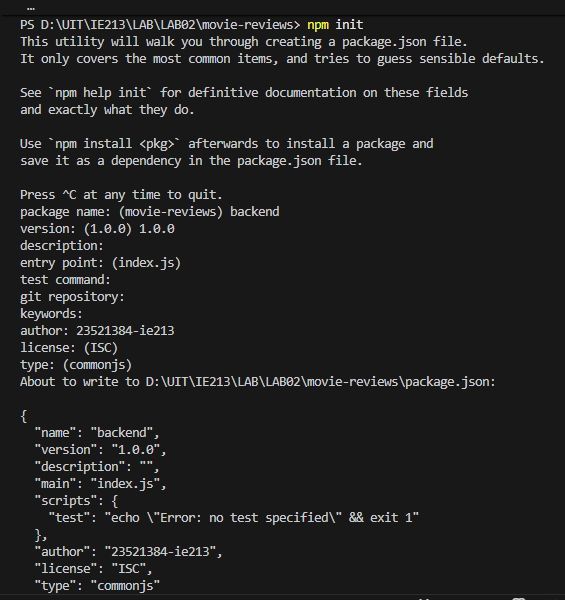

#### 1.5 Cài đặt một số dependency của dự án như mongodb, express, cors, dotenv.

**Kết quả**

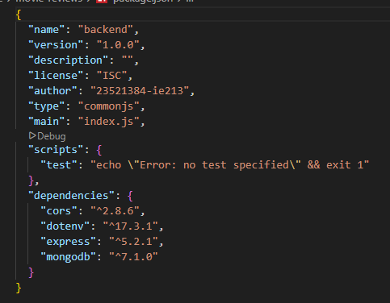

#### 1.6 Cài đặt nodemon

**Kết quả**

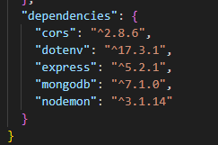

### Bài 2: Xây dựng Backend

#### 2.1 Tạo tệp tin server.js là nơi khởi tạo máy chủ web (tệp này nằm trong thư mục backend).

**Kết quả**

[server.js](./movie-reviews/backend/server.js)

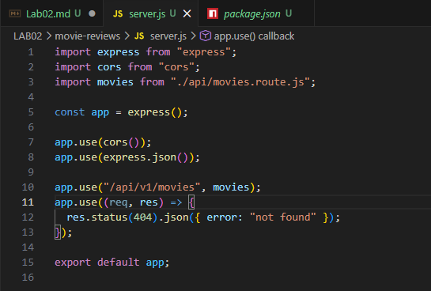

#### 2.2 Tạo tệp tin .env để lưu trữ thông tin biến môi trường phát triển như URI kết nối tới DB trên MongoDB Atlas, PORT dịch vụ web, ví dụ 3000.

**Kết quả**

[.env]

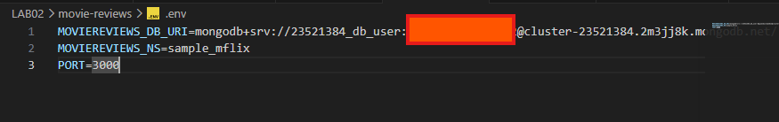

#### 2.3 Tạo tệp tin index.js để quản lý việc kết nối dữ liệu, khởi tạo đối tượng, và chạy máy chủ.

**Kết quả**

[index.js](../lab02/movie-reviews/backend/index.js)

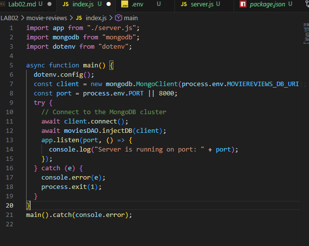

#### 2.4 Tạo thư mục và tệp tin tương ứng trong thư mục backend gồm api/movies.route.js để xử lý các định tuyến liên quan đến ứng dụng minh hoạ movies về sau.

**Kết quả**

[movies.route.js](../lab02/movie-reviews/backend/api/movies.route.js)

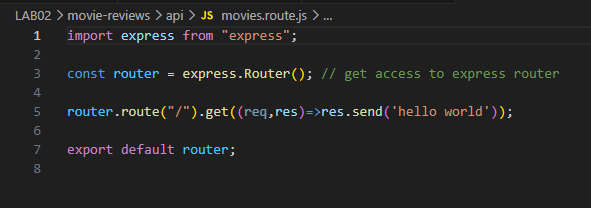

#### 2.5 Thiết lập công cụ truy xuất dữ liệu cho ứng dụng Movie với DAO – Data Access Object.

**Kết quả**

[moviesDAO.js](../lab02/movie-reviews/backend/dao/moviesDAO.js)

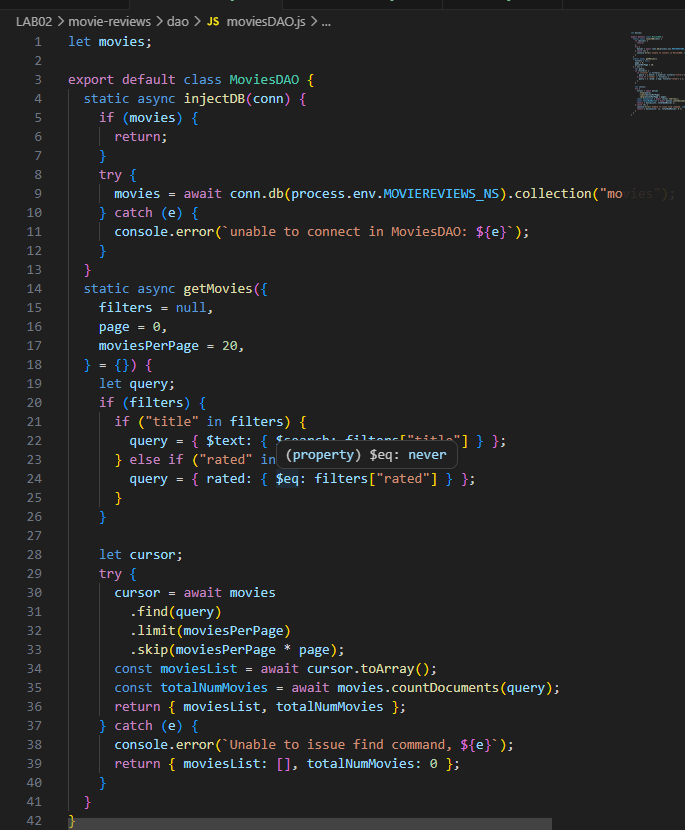

#### 2.6 Thiết lập CONTROLLER cho ứng dụng web để gọi tới DAO.

**Kết quả**

[movies.controller](../lab02/movie-reviews/backend/api/movies.controller.js)

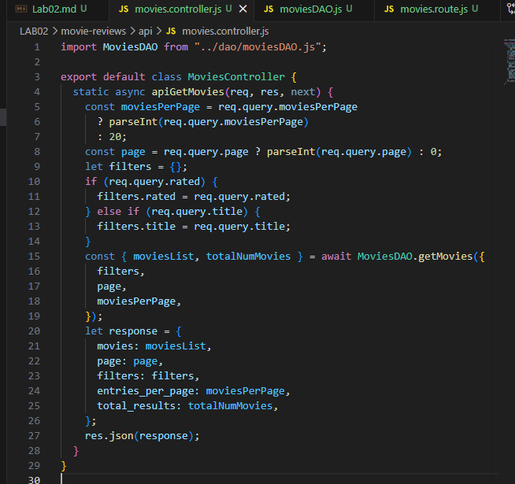

#### 2.7 Đưa Controller vừa tạo ở yêu cầu 2.6 vào định tuyến

**Thực hiện**

- Chỉnh sửa lại tiệp tin movies.route.js : Thêm apiGetMovies

  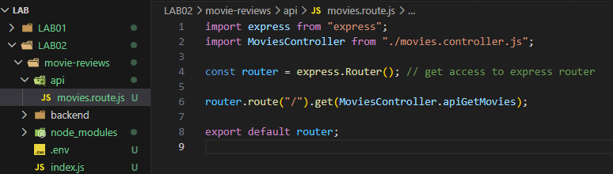

- Chạy lệnh npm start

  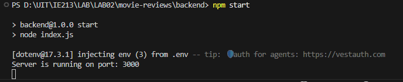

**Kết quả**

- Truy cập localhost:3000/api/v1/movies/

  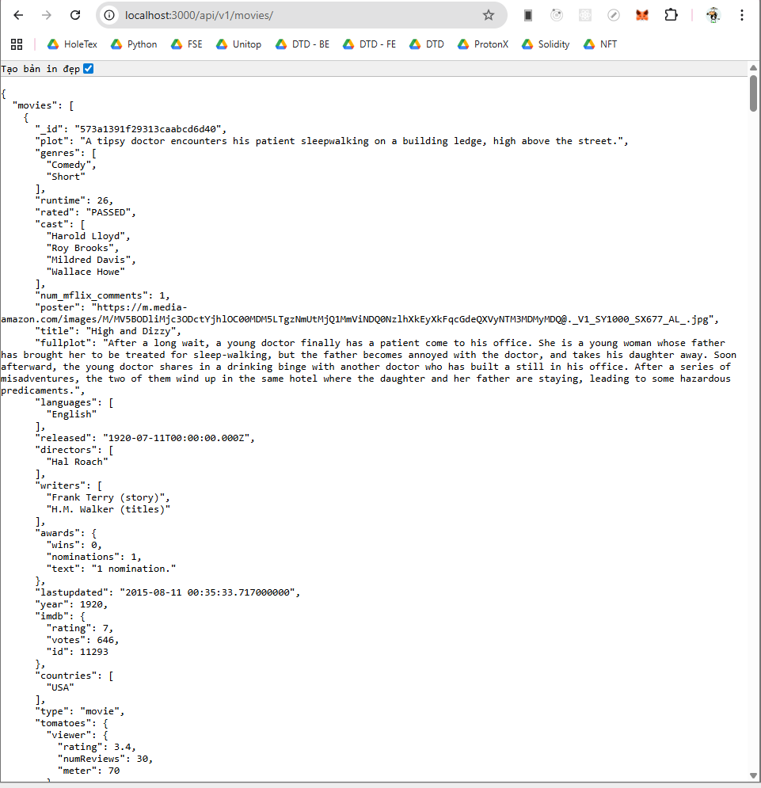
