# LAB05 – Xây dựng Frontend với ReactJS

---

## Thông tin sinh viên

- Họ tên: Đinh Nguyễn Đức Tâm
- MSSV: 23521384
- Môn học: IE213.Q21 – Kỹ thuật phát triển hệ thống Web
- Lớp: IE213.Q21.1

---

## Mục tiêu

- Hiểu được cách kết nối từ frontend tới backend với ReactJS
- Giới thiệu một số package chủ yếu trong việc xây dựng mã nguồn frontend
- Tạo các form để người dùng nhập vào tìm kiếm dữ liệu
- Hiển thị danh sách movie thông qua các component của React-Bootstrap như Card, Link, Switch, Route
- Giới thiệu các hook như `useState()` và `useEffect()` trong ReactJS
- Hiển thị một trang chi tiết về Movie (ứng dụng minh hoạ)
- Hiển thị các review có liên quan đến Movie

---

## Lưu ý quan trọng

Lab 05 là phần **tiếp nối trực tiếp** từ Lab 03 và Lab 04:

- **Backend (Lab 03)**: các API `/movies`, `/movies/id/:id`, `/movies/ratings`, `/movies/review` phải đang chạy ở `localhost:3000` (hoặc port đã cấu hình)
- **Frontend (Lab 04)**: cấu trúc component và routing đã được thiết lập sẵn — Lab 05 sẽ điền nội dung vào các component còn rỗng

---

## Công cụ sử dụng

- NodeJS
- ReactJS
- React-Bootstrap
- React Router DOM
- Axios
- Moment.js
- VS Code
- Insomnia

---

## Cấu trúc thư mục bài thực hành 5

```text
lab05
├── movie-reviews/
│   ├── backend/
│   │   ├── api/
│   │   │   ├── movies.controller.js
│   │   │   ├── movies.route.js
│   │   │   └── reviews.controller.js
│   │   ├── dao/
│   │   │   ├── moviesDAO.js
│   │   │   └── reviewsDAO.js
│   │   ├── index.js
│   │   ├── package.json
│   │   └── server.js
│   └── frontend/
│       ├── public/
│       ├── src/
│       │   ├── components
│       │   │   ├── add-review.js
│       │   │   ├── login.js
│       │   │   ├── movie.js
│       │   │   └── movies-list.js
│       │   ├── services
│       │   │   └── movies.js
│       │   ├── App.css
│       │   ├── App.js
│       │   ├── index.css
│       │   └── index.js
│       └── package.json
├── screenshots/
└── Lab05.md
```

---

## Thực hiện

### Bài 1: Kết nối tới Backend

#### 1.1 Cài đặt axios cho dự án hiện tại

**Kết quả**

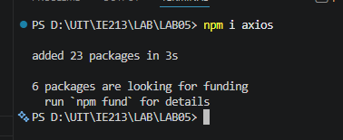

#### 1.2 Tạo lớp dịch vụ có tên MovieDataService trong thư mục .src/services/movies.js

**Kết quả**

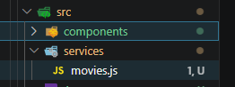

#### 1.3 Tạo các lời gọi dịch vụ tới backend

Các phương thức được triển khai trong `MovieDataService`:

- `getAll(page)` — lấy danh sách phim (có phân trang)
- `get(id)` — lấy thông tin chi tiết phim theo id
- `find(query, by, page)` — tìm kiếm phim theo title hoặc rating
- `createReview(data)` — thêm review mới
- `updateReview(data)` — cập nhật review
- `deleteReview(id, userId)` — xoá review
- `getRatings()` — lấy danh sách các loại rating

Mỗi phương thức tương ứng với một endpoint đã xây dựng ở backend (Lab 03).

**Kết quả**

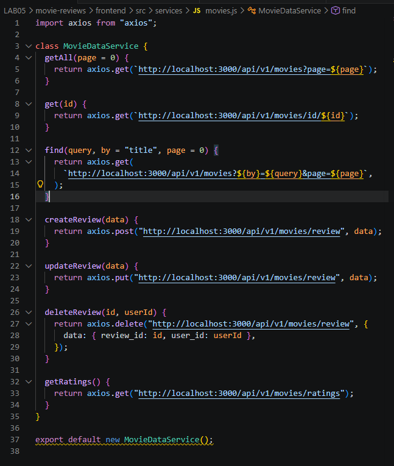

---

### Bài 2: Xây dựng MoviesList Component

#### 2.1 Tạo các biến trạng thái: movies, searchTitle, searchRating, ratings sử dụng useState().

**Kết quả**

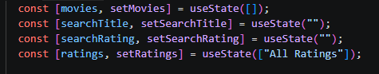

#### 2.2 Tạo 2 phương thức retrieveMovies() và retrieveRatings() để lấy thông tin movie cùng danh sách các loại ratings. Và dùng useEffect() để gọi chung sau khi giao diện kết xuất xong.

**Kết quả**

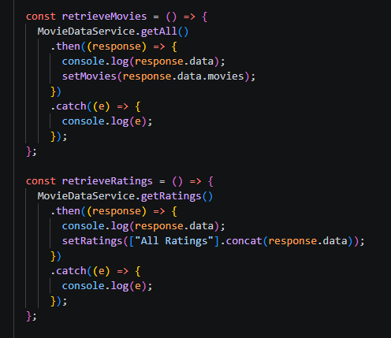

#### 2.3 Tạo 2 search form gồm tìm theo title, và tìm theo rating.

**Kết quả**

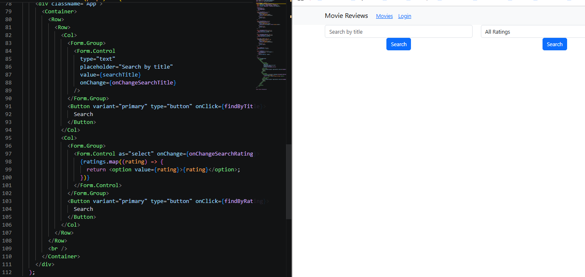

#### 2.4 Hiển thị danh sách phim bằng `<Card>` của React-Bootstrap

**Kết quả**

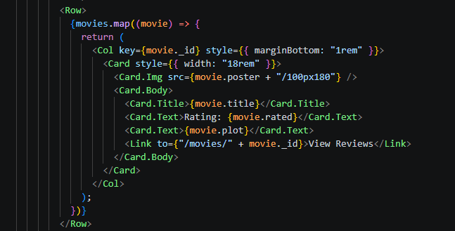


#### 2.5 Hiện thực 2 phương thức findByTitle() và findByRating() để tìm phim theo Title hoặc Rating.

**Kết quả**

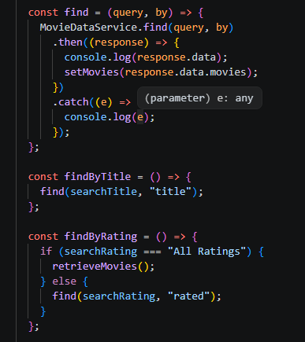
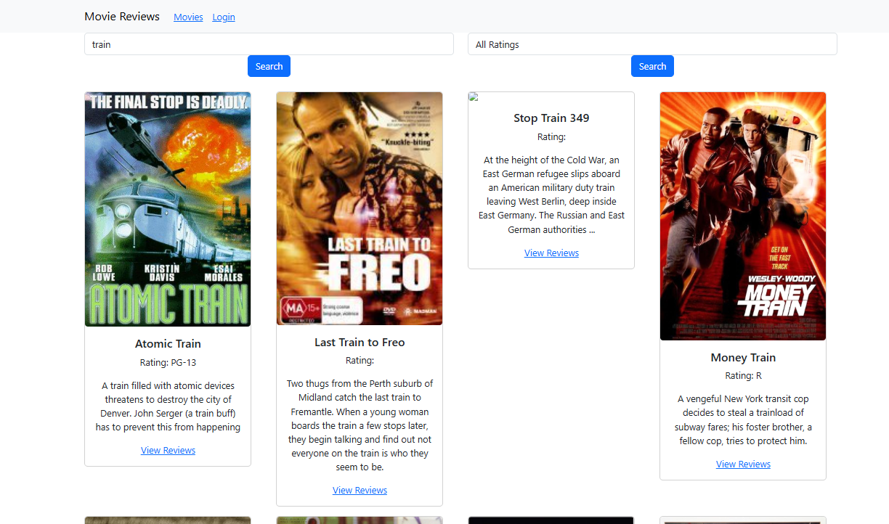

---

### Bài 3: Hiển thị thông tin trang Movie khi nhấn vào "View Reviews"

#### 3.1 Thiết lập state cho component Movie

Khai báo state `movie` với các trường: `id`, `title`, `rated`, `reviews`.

**Kết quả**

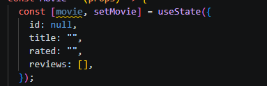

#### 3.2 Xây dựng mã nguồn cho phương thức getMovie() trong component này để gọi phương thức get() trong MovieDataService.

**Kết quả**

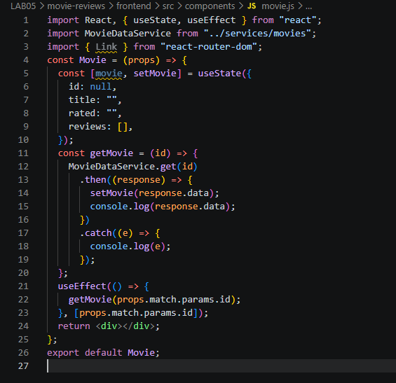

#### 3.3 Trang trí phần JSX

**Kết quả**

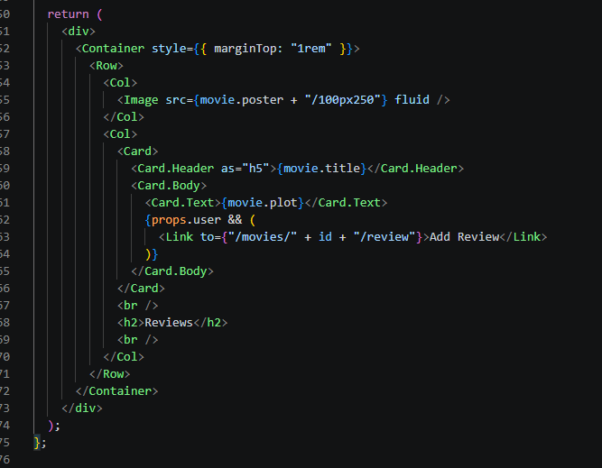
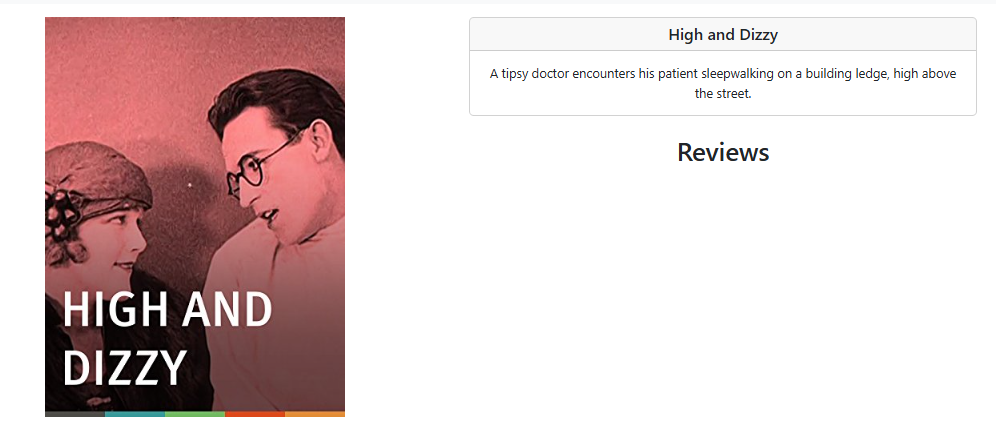

---

### Bài 4: Hiển thị danh sách Review dưới phần Plot

#### 4.1 Viết JSX hiển thị danh sách review

Dùng `movie.reviews.map()` để render từng review gồm: tên người review,
ngày review, nội dung review. Nếu user đang đăng nhập và là tác giả,
hiển thị thêm nút "Edit" và "Delete".

**Kết quả**

[movie.js](./movie-reviews/frontend/src/components/movie.js)

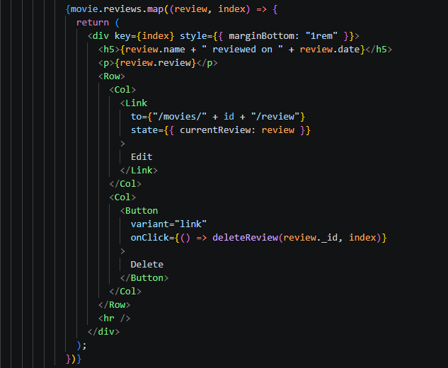

#### 4.2 Thêm review mẫu qua Insomnia

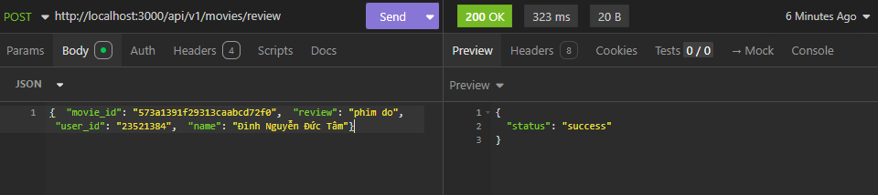
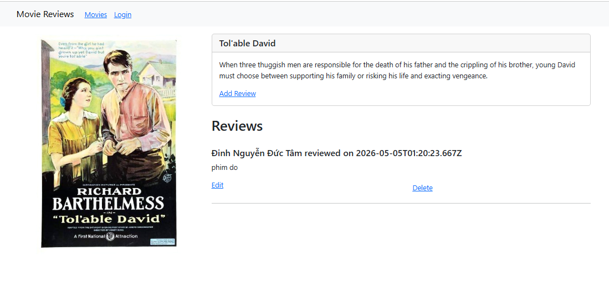

#### 4.3 Định dạng thời gian với Moment.js

Cài đặt moment.js:

```bash
npm install moment
```

Sử dụng trong JSX:

```jsx
{
  moment(review.date).format("Do MMMM YYYY");
}
```

**Kết quả**

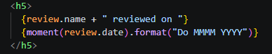
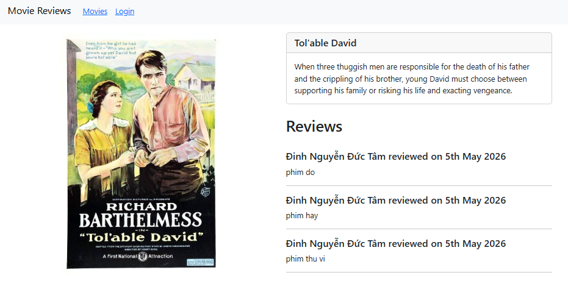
